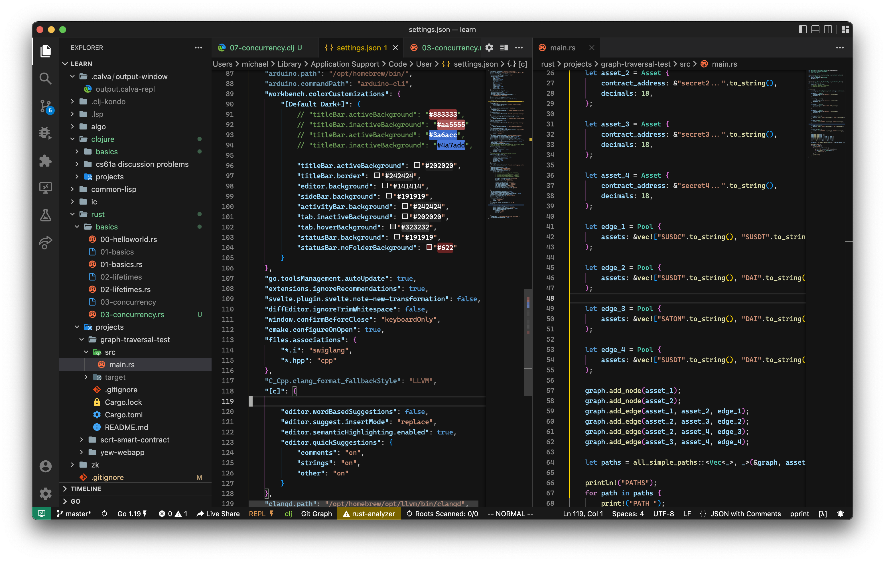

# VSCode Config

| Platform 		| Config Path 	|
| ---			| ---			|
| macOS | `/Users/michael/Library/Application Support/VSCodium/User` |


## Pure Dark Theme

Slight, cleaner variation on original Dark+ theme



```json
"workbench.colorCustomizations": {
	"[Default Dark+]": {
		"titleBar.activeBackground": "#202020",
		"titleBar.border": "#242424",
		"editor.background": "#141414",
		"sideBar.background": "#191919",
		"activityBar.background": "#242424",
		"tab.inactiveBackground": "#202020",
		"tab.hoverBackground": "#323232",
		"statusBar.background": "#191919"
	}
},

```

## Code/Codium Differentiator

Red titlebar to distinguish VSCode windows (Codium preferred):

```json
"workbench.colorCustomizations": {
	"[Default Dark+]": {
		"titleBar.activeBackground": "#aa5555",
		"titleBar.inactiveBackground": "#883333"
	}
}
```


